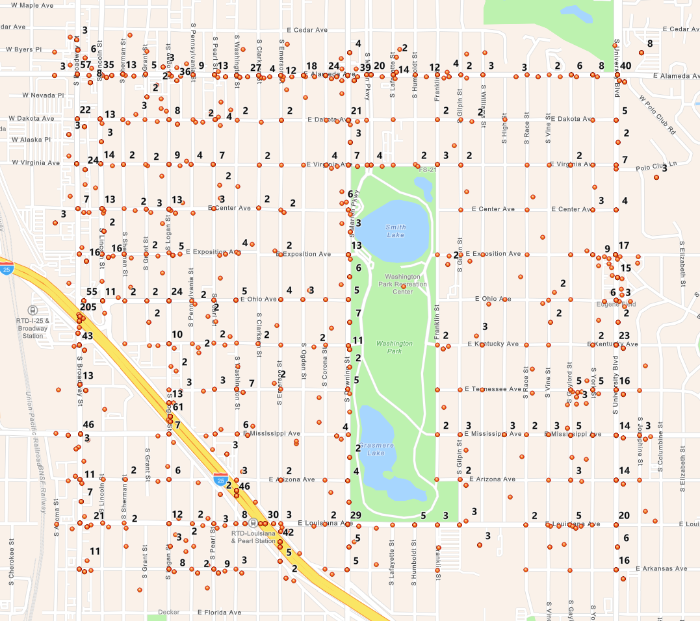

# ArcGISRuntimeClustering

Simple example showing how clustering can be accomplished in ArcGIS Runtime 100.x. This example calculates the number of overlapping points an associated feature layer service has, and displays them in a graphics overlay. This sample could be altered to adjust the symbology of a feature layer, but there are performance considerations and approaches to consider.

